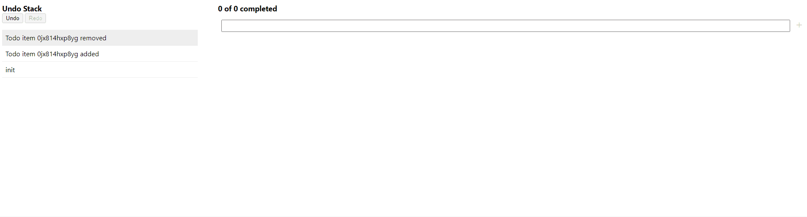

# @gira-de/svelte-undo

Provides low-level utility functions to use Svelte [Stores](https://svelte.dev/tutorial/writable-stores) in combination with redo/undo capabilities. Relies on [immer.js](https://immerjs.github.io/immer/).

[Example App](https://github.com/gira-de/svelte-undo-example)



## Features

- **UndoStack** contains the history of all changes
- **Undo/Redo/Goto** reverts the model to a specific state
- **Transactions** map multiple changes in one undo step
- **Commit Messages** for every undo stack entry
- **immer.js** keeps the undo stack small by using patches
- **Snapshots** export/import the undo stack to/from JSON
- **Typescript** support

## Installation

```bash
# using npm
npm install -D @gira-de/svelte-undo

# or using pnpm
pnpm install -D @gira-de/svelte-undo

# or using yarn
yarn add -D @gira-de/svelte-undo
```

## Usage examples

### Push actions to undo stack

```ts
import { undoStack, SetAction } from '@gira-de/svelte-undo';

// create undo stack
const myUndoStack = undoStack('first stack message');
const msgStore = writable('old value');

// create a new action to update the store value
const action = new SetAction(msgStore, 'new value', 'set new value');

// apply the action
action.apply();
console.log($msgStore); // 'new value'

// push action onto the undo stack
myUndoStack.push(action);

// call undo() to revert the changes
myUndoStack.undo();
console.log($msgStore); // 'old value'
```

### Use transactions

Creating actions and manually pushing them to the undo stack might create a lot of boilerplate code. The use of a Transaction simplifies this.

```ts
import { undoStack, transactionCtrl } from '@gira-de/svelte-undo';

// create a store as usual
const personStore = writable({ name: 'John', age: '23' });

// create undo stack and a transaction controller
const myUndoStack = undoStack('created');
const myTransactionCtrl = transactionCtrl(myUndoStack.push);

// apply model changes on the draft state
let personDraft = myTransactionCtrl.draft(personStore);
personDraft['age'] = 24;

// apply all changes made to the drafts
myTransactionCtrl.commit('happy birthday');
console.log($personStore); // { name: 'John', age: '24' }

// call undo() to revert the changes
myUndoStack.undo();
console.log($personStore); // { name: 'John', age: '23' }
```

Limitations: The transaction controller can only be used with Svelte stores that hold an Object-like value (object, array, map, set).

### Save from & load to undo stack

```ts
import { undoStack, transactionCtrl } from '@gira-de/svelte-undo';

// push an undo step to the undo stack
const myUndoStack = undoStack('created');
const myTransactionCtrl = transactionCtrl(myUndoStack.push);
const personStore = writable({ name: 'John', age: '23' });
myTransactionCtrl.draft(personStore)['age'] = 24;
myTransactionCtrl.commit('happy birthday');

// provide a store id for each store used in the undo stack
const stores = {
  person: personStore,
};

// create a snapshot
const undoStackSnapshot = myUndoStack.createSnapshot(stores);

// snapshot can easily be stringified to json
const json = JSON.stringify(undoStackSnapshot);

console.log(json);
// {
//    index: 1,
//    actions: [
//      { type: 'init', msg: 'created' },
//      { type: 'mutate', msg: 'happy birthday', storeId: 'person', data: ... }
//    ]
// }

// later: load the undo stack snapshot
myUndoStack.loadSnapshot(JSON.parse(json), stores);
```

## Documentation

### undoStack

The _undoStack_ is basically a Svelte store with various properties and functions. It always contains at least one undo step (action).

#### Instantiation examples:

`const myUndoStack = undoStack('first undo stack message');`

`const myUndoStack = undoStack({ user: 'xyz', msg: 'project created' });`

#### Properties

- $myUndoStack.**actions**
  - a list of all actions that are currently on the undo stack
- $myUndoStack.**selectedAction**
  - the current active step whose changes are applied to the model
- $myUndoStack.**canUndo**
  - _true_ if the _selectedAction_ is not the first action on the undo stack
  - _false_ otherwise
- $myUndoStack.**canRedo**
  - _true_ if the _selectedAction_ is not the last action on the undo stack
  - _false_ otherwise
- $myUndoStack.**index**
  - the index of the current _selectedAction_
  - e.g. is _0_ if _canUndo_ is false

#### Functions

- myUndoStack.**push(action)**
  - pushes a new action onto the undo stack and selects the action
  - does not apply the action state, this has to be done manually
  - it's recommended to use the transaction controller instead of pushing actions manually
- myUndoStack.**undo()**
  - reverts the state of the selected action and selects the previous action
  - does nothing if there's no previous action on the undo stack
- myUndoStack.**redo()**
  - selects the next action and applies its state
  - does nothing if there's no next action on the undo stack
- myUndoStack.**goto(seqNbr)**
  - selects the action for the specified sequence number (_action.seqNbr_) and applies/reverts all actions between
  - has basically the same effect as calling undo/redo in a loop
- myUndoStack.**clear()**
  - removes all actions from the undo stack and creates a new init action
  - has the same effect as if a new undo stack has been created
- myUndoStack.**clearRedo()**
  - Removes all redoable actions from the stack
  - This is the same as would happen if a new action is pushed while not being at the latest state,
    just without pushing the action
- myUndoStack.**clearUndo()**
  - Deletes all previous undo actions
  - If the current position is the top of the stack, this effectively deletes the whole undo stack
  - If not at the top of the stack, undo actions are still available and undo is possible
- myUndoStack.**createSnapshot(stores)**
  - creates and returns a snapshot of the undo stack
  - the snapshot can be easily serialized since it does not contain any store references etc.
- myUndoStack.**loadSnapshot(undoStackSnapshot, stores)**
  - clears the undo stack and then loads the specified snapshot
- myUndoStack.**erase(seqNbr?)**
  - removes undo/redo capability from actions to reduce the size of the undo stack
  - all actions starting from the specified sequence number are erased
  - starts erasing from the top of the stack if seqNbr is undefined
  - erased actions are still included on the undo stack in form of log entries
  - this function is currently experimental and might not always yield the expected state

### transactionCtrl

#### Instantiation

`const myTransactionCtrl = transactionCtrl(myUndoStack.push);`

#### Functions

- myTransactionCtrl.**draft(store)**
  - returns a new draft object for the specified store
  - all changes to the draft object must be followed by a commit, otherwise they will not visible in the store
- myTransactionCtrl.**commit(msg)**
  - applies all draft changes to the corresponding stores
  - calling _commit_ without having any draft changes has no effect
- myTransactionCtrl.**rollback()**
  - discards all draft changes since the last commit
  - calling _commit_ after a _rollback_ has no effect

## Known issues

- Working with arrays (pushing/removing items) might create very large undo stack entries.

## Contributing

Contributions are always welcome! Please have a look at our [CONTRIBUTING.md](CONTRIBUTING.md)
